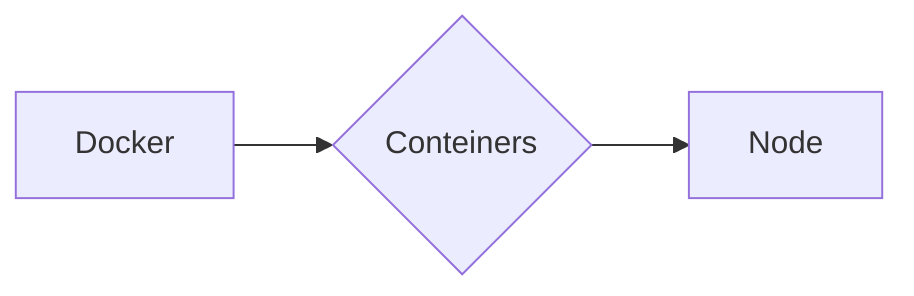

# Sobre o Projeto:
Estudos utilizando o Docker + React.js

- React.js
- Docker 


### REACT.JS

```
1º - npx create-react-app dockerized-react-app
2º - cd dockerized-react-app
```

### DOCKER COMPOSE

```
1º - docker-compose up -d --build
```


### FLUXOGRAMA/DIAGRAMA




### FONTE:
<ul>
  
  <li>
    <p><b><code>Dockerizando uma aplicação React JS.</code></b></p>
    <p><i>URL: https://blog.codeexpertslearning.com.br/dockerizando-uma-aplica%C3%A7%C3%A3o-react-js-f6a22e93bc5d </i></p>
  </li> 
  
</ul>